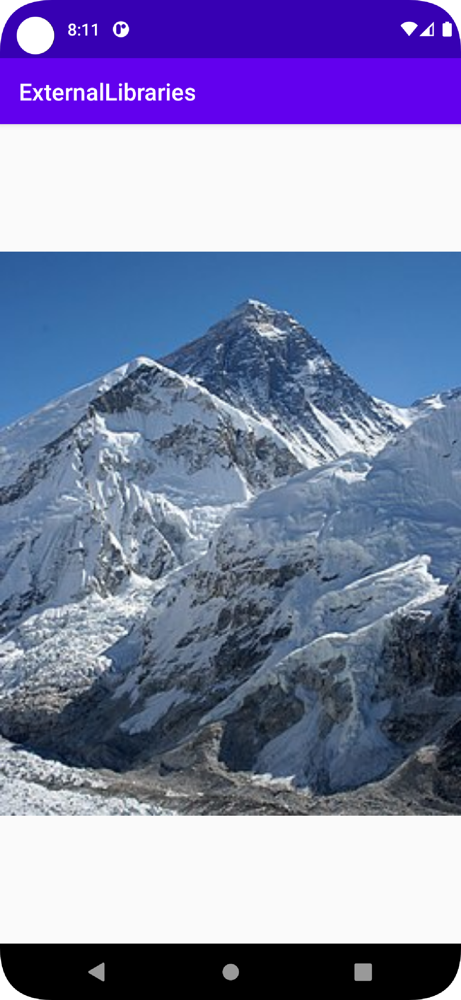

# Rapport

**Skriv din rapport här!**
Googlade på top 10 library for android.
Hittade ett image library Glide, under top 10 listan,
Lade in Glide som ett externt bibliotek.
```Java
    implementation ("com.github.bumptech.glide:glide:4.11.0")
```
Skapade ett imageView.
Använde glide till att visa en bild på mount everest från wikipedia i imageView.
```Java
 Glide.with(this).load("https://upload.wikimedia.org/wikipedia/commons/thumb/4/4b/Everest_kalapatthar_crop.jpg/256px-Everest_kalapatthar_crop.jpg").into(imageView);
```


